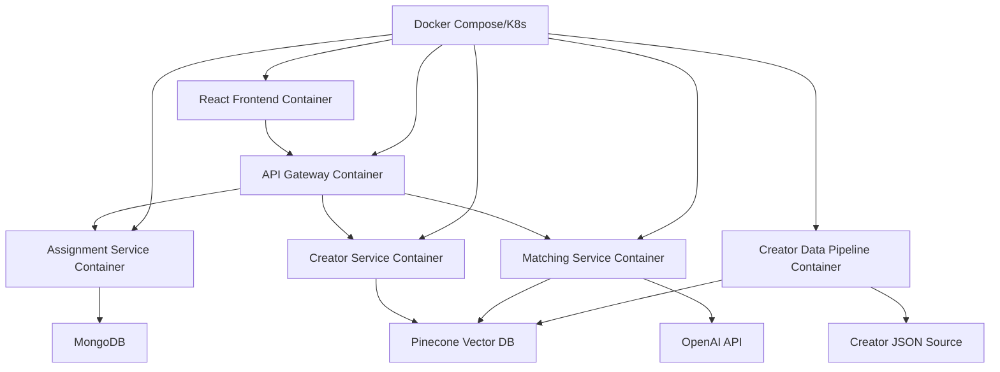

# Design Document

## Overview

The Creator Assignment Matcher is a full-stack web application that intelligently matches content assignments with creators using a hybrid approach combining semantic similarity and rule-based filtering. The system features a React frontend for assignment submission and results display, with a Node.js backend that orchestrates matching logic using Pinecone for vector similarity search and MongoDB for user data persistence.

The architecture prioritizes performance, scalability, and user experience while maintaining flexibility for future enhancements to matching algorithms and creator data sources.

## Architecture

### High-Level Architecture



### Microservices Architecture

The system is designed as containerized microservices for cloud deployment:

- **Frontend Container**: React SPA served by Nginx, containerized for scalable deployment
- **API Gateway Container**: Express.js gateway with load balancing, rate limiting, and service discovery
- **Assignment Service Container**: Dedicated service for assignment CRUD operations and validation
- **Creator Service Container**: Isolated service for creator data management and embeddings
- **Matching Service Container**: Core matching logic service with horizontal scaling capabilities
- **Creator Data Pipeline Container**: Background service for processing creator data updates

### Container Architecture

- **Base Images**: Node.js Alpine for backend services, Nginx Alpine for frontend
- **Multi-stage Builds**: Optimized Docker images with separate build and runtime stages
- **Health Checks**: Container health endpoints for orchestration and monitoring
- **Environment Configuration**: 12-factor app principles with environment-based configuration
- **Service Mesh**: Ready for Istio/Envoy integration for advanced traffic management

### Component Architecture

- **Frontend Layer**: React SPA with form handling, state management, and responsive UI (containerized)
- **API Layer**: Express.js REST API with proper error handling and rate limiting (containerized)
- **Business Logic Layer**: Modular microservices for assignment processing, creator management, and matching algorithms
- **Data Layer**: MongoDB for structured data, Pinecone for vector operations
- **External Services**: OpenAI API for embeddings generation and content framing
- **Orchestration**: Docker Compose for local development, Kubernetes-ready for production

## Components and Interfaces

### Frontend Components

#### AssignmentForm Component
- **Purpose**: Collect assignment details with progressive disclosure
- **Props**: `onSubmit: (assignment: Assignment) => void`, `loading: boolean`
- **State**: Form validation, field visibility, submission status
- **Key Features**: Real-time validation, optional field expansion, loading states

#### ResultsView Component
- **Purpose**: Display top 3 creator matches with detailed explanations
- **Props**: `matches: CreatorMatch[]`, `loading: boolean`, `error?: string`
- **State**: Selected creator details, expanded match reasoning
- **Key Features**: Creator cards, match scoring visualization, framing suggestions

#### CreatorCard Component
- **Purpose**: Individual creator profile display within results
- **Props**: `creator: Creator`, `matchScore: number`, `reasoning: string`, `framing: string`
- **State**: Expanded details view
- **Key Features**: Avatar display, metrics visualization, expandable content

### Backend Microservices

#### AssignmentService (Containerized + Serverless-Ready)
- **Purpose**: Handle assignment CRUD operations and validation
- **Methods**: `createAssignment()`, `getAssignmentHistory()`, `validateAssignment()`
- **Dependencies**: MongoDB connection, validation schemas
- **Container**: Node.js Alpine with health checks and graceful shutdown
- **Serverless Design**: Stateless functions with connection pooling, cold start optimization
- **Scaling**: Horizontal scaling based on request volume, ready for AWS Lambda/Azure Functions

#### CreatorService (Containerized + Serverless-Ready)
- **Purpose**: Manage creator data and embeddings
- **Methods**: `getCreatorById()`, `updateCreatorEmbeddings()`, `searchCreators()`
- **Dependencies**: Pinecone client, OpenAI API
- **Container**: Node.js Alpine with vector database connection pooling
- **Serverless Design**: Stateless with external connection management, optimized for function execution
- **Scaling**: Auto-scaling based on embedding generation workload, FaaS-compatible

#### MatchingService (Containerized + Serverless-Ready)
- **Purpose**: Core matching logic combining semantic and rule-based approaches
- **Methods**: `findMatches()`, `calculateSemanticSimilarity()`, `applyRuleBasedScoring()`
- **Dependencies**: CreatorService, AI services for framing generation
- **Container**: Node.js Alpine optimized for CPU-intensive matching algorithms
- **Serverless Design**: Pure functions with no persistent state, optimized for cold starts
- **Scaling**: Horizontal scaling with load balancing, ready for serverless auto-scaling

#### API Gateway (Containerized + Serverless-Ready)
- **Purpose**: Route requests, handle authentication, rate limiting, and service discovery
- **Methods**: Request routing, load balancing, circuit breaker patterns
- **Dependencies**: Service registry, authentication service
- **Container**: Express.js with Nginx reverse proxy
- **Serverless Design**: Middleware functions compatible with AWS API Gateway/Azure API Management
- **Features**: SSL termination, request/response logging, metrics collection

### Serverless Migration Strategy

#### Function Architecture Design
- **Stateless Functions**: All services designed as pure functions without persistent state
- **Connection Management**: External connection pooling using services like MongoDB Atlas, Pinecone managed service
- **Cold Start Optimization**: Minimal dependencies, lazy loading, connection reuse patterns
- **Environment Abstraction**: Configuration through environment variables and external secret management

#### Serverless-Compatible Patterns
- **Handler Functions**: Each service method designed as individual handler functions
- **Dependency Injection**: External dependencies injected rather than instantiated within functions
- **Async/Await**: Non-blocking operations optimized for serverless execution models
- **Error Handling**: Proper error responses compatible with API Gateway error mapping

#### Migration Path
1. **Phase 1**: Container deployment with serverless-ready architecture
2. **Phase 2**: Extract individual functions while maintaining container deployment
3. **Phase 3**: Deploy functions to serverless platform (AWS Lambda, Azure Functions, Vercel)
4. **Phase 4**: Replace container orchestration with serverless orchestration (Step Functions, Logic Apps)

### API Endpoints

```
# Frontend Container (Nginx)
GET / - Serve React SPA
GET /static/* - Serve static assets

# API Gateway Container
POST /api/assignments
GET /api/assignments/:id
POST /api/matches
GET /api/creators/:id
POST /api/creators/embeddings/refresh
GET /health - Health check endpoint

# Assignment Service Container
POST /assignments
GET /assignments/:id
GET /assignments/history/:userId

# Creator Service Container  
GET /creators/:id
POST /creators/embeddings/refresh
GET /creators/search

# Matching Service Container
POST /matches
GET /matches/:id
```

### Container Configuration

#### Dockerfile Structure
```dockerfile
# Multi-stage build example for backend services
FROM node:18-alpine AS builder
WORKDIR /app
COPY package*.json ./
RUN npm ci --only=production

FROM node:18-alpine AS runtime
WORKDIR /app
COPY --from=builder /app/node_modules ./node_modules
COPY . .
EXPOSE 3000
HEALTHCHECK --interval=30s --timeout=3s --start-period=5s --retries=3 \
  CMD curl -f http://localhost:3000/health || exit 1
CMD ["node", "server.js"]
```

#### Docker Compose Configuration
```yaml
version: '3.8'
services:
  frontend:
    build: ./frontend
    ports:
      - "80:80"
    depends_on:
      - api-gateway
      
  api-gateway:
    build: ./api-gateway
    ports:
      - "3000:3000"
    environment:
      - NODE_ENV=production
      - SERVERLESS_READY=true  # Flag for serverless-compatible mode
    depends_on:
      - assignment-service
      - creator-service
      - matching-service
      
  assignment-service:
    build: ./assignment-service
    environment:
      - MONGODB_URI=${MONGODB_URI}
      - SERVERLESS_READY=true
      - CONNECTION_POOL_SIZE=5  # Optimized for serverless migration
    depends_on:
      - mongodb
      
  creator-service:
    build: ./creator-service
    environment:
      - PINECONE_API_KEY=${PINECONE_API_KEY}
      - OPENAI_API_KEY=${OPENAI_API_KEY}
      - SERVERLESS_READY=true
      - COLD_START_OPTIMIZATION=true
      
  matching-service:
    build: ./matching-service
    environment:
      - PINECONE_API_KEY=${PINECONE_API_KEY}
      - OPENAI_API_KEY=${OPENAI_API_KEY}
      - SERVERLESS_READY=true
      - STATELESS_MODE=true
    depends_on:
      - creator-service
      
  mongodb:
    image: mongo:6
    volumes:
      - mongodb_data:/data/db
      
volumes:
  mongodb_data:
```

#### Serverless Function Structure
```javascript
// Example serverless-ready function structure
export const handler = async (event, context) => {
  // Dependency injection for external connections
  const dependencies = await initializeDependencies();
  
  // Pure function logic
  const result = await processRequest(event, dependencies);
  
  // Cleanup for optimal resource usage
  await cleanup(dependencies);
  
  return result;
};

// Reusable business logic separated from handler
const processRequest = async (event, deps) => {
  // Stateless processing logic
};
```

## Data Models

### Assignment Model
```typescript
interface Assignment {
  id: string;
  topic: string;
  keyTakeaway: string;
  additionalContext: string;
  targetAudience?: {
    demographic: string;
    locale: string;
  };
  creatorValues?: string[];
  creatorNiches?: string[];
  toneStyle?: string;
  createdAt: Date;
  userId?: string;
}
```

### Creator Model
```typescript
interface Creator {
  uniqueId: string;
  nickname: string;
  bio: string;
  followerCount: number;
  region: string;
  avatarUrl: string;
  analysis: {
    summary: string;
    primaryNiches: string[];
    secondaryNiches: string[];
    apparentValues: string[];
    audienceInterests: string[];
    engagementStyle: {
      tone: string[];
      contentStyle: string;
    };
  };
  embeddings?: {
    bio: number[];
    niches: number[];
    values: number[];
  };
}
```

### CreatorMatch Model
```typescript
interface CreatorMatch {
  creator: Creator;
  matchScore: number;
  reasoning: string;
  framingSuggestion: string;
  scoreBreakdown: {
    semanticSimilarity: number;
    nicheAlignment: number;
    audienceMatch: number;
    valueAlignment: number;
    engagementFit: number;
  };
}
```

## Error Handling

### Frontend Error Handling
- **Form Validation**: Real-time field validation with clear error messages
- **API Errors**: User-friendly error states with retry mechanisms
- **Network Issues**: Offline detection and graceful degradation
- **Loading States**: Skeleton screens and progress indicators

### Backend Error Handling
- **Input Validation**: Comprehensive request validation with detailed error responses
- **Database Errors**: Connection retry logic and fallback mechanisms
- **External API Failures**: Circuit breaker pattern for third-party services
- **Rate Limiting**: Proper HTTP status codes and retry-after headers

### Error Recovery Strategies
- **Pinecone Unavailable**: Fallback to rule-based matching only
- **OpenAI API Limits**: Queue requests with exponential backoff
- **MongoDB Connection Issues**: Read replica failover and connection pooling

## Testing Strategy

The testing approach combines unit tests for individual components and property-based tests for core matching logic to ensure correctness across diverse inputs.

### Unit Testing
- **Frontend**: Component testing with React Testing Library
- **Backend**: Service layer testing with Jest and supertest
- **API Integration**: Contract testing for external services
- **Database Operations**: Integration tests with test database instances

### Property-Based Testing
Property-based tests will verify universal properties using fast-check library with minimum 100 iterations per test. Each test will be tagged with comments referencing the corresponding correctness property from this design document.

**Testing Framework**: fast-check for JavaScript/TypeScript property-based testing
**Test Configuration**: Minimum 100 iterations per property test
**Test Tagging Format**: `**Feature: creator-assignment-matcher, Property {number}: {property_text}**`
#
# Correctness Properties

*A property is a characteristic or behavior that should hold true across all valid executions of a system-essentially, a formal statement about what the system should do. Properties serve as the bridge between human-readable specifications and machine-verifiable correctness guarantees.*

### Property Reflection

After analyzing all acceptance criteria, several properties can be consolidated to eliminate redundancy:

- Properties related to UI display of creator information (3.1, 3.3) can be combined into a single comprehensive property
- Properties about framing generation incorporating creator attributes (4.1, 4.3, 4.5) can be unified into one property about comprehensive framing generation
- Database performance properties (6.3, 7.2) can be combined into a general performance property
- Data validation and security properties (6.2, 6.4) can be merged into a comprehensive data security property

### Core Properties

Property 1: Form validation prevents invalid submissions
*For any* assignment form data that is missing required fields (topic, key takeaway, or additional context), the form submission should be prevented and validation messages should be displayed
**Validates: Requirements 1.3**

Property 2: Optional field interactions provide required options
*For any* user interaction with optional fields, the form should provide at least target audience and creator values selection options
**Validates: Requirements 1.2**

Property 3: Valid form submissions trigger complete workflow
*For any* valid assignment data, form submission should store the data and initiate the matching process
**Validates: Requirements 1.4**

Property 4: Loading states display during processing
*For any* form submission or matching process, appropriate loading states with progress indicators should be displayed
**Validates: Requirements 1.5**

Property 5: Matching engine performs semantic search
*For any* assignment processed by the matching engine, semantic similarity search should be performed against creator embeddings
**Validates: Requirements 2.1**

Property 6: Rule-based scoring applied to semantic candidates
*For any* set of semantic search candidates, rule-based scoring for niche alignment, audience demographics, and creator values should be applied
**Validates: Requirements 2.2**

Property 7: Tie-breaking logic for similar scores
*For any* set of creators with similar match scores, engagement metrics and content style compatibility should be used as tie-breakers
**Validates: Requirements 2.3**

Property 8: Score combination uses weighted algorithms
*For any* semantic similarity and rule-based scores, the final match score should combine them using weighted algorithms
**Validates: Requirements 2.4**

Property 9: Matching returns exactly three ranked creators
*For any* completed matching process, exactly three creators should be returned ranked by match score
**Validates: Requirements 2.5**

Property 10: Results display comprehensive creator information
*For any* creator match result, the display should include creator name, avatar, bio, key profile information, follower count, engagement metrics, and primary content niches
**Validates: Requirements 3.1, 3.3**

Property 11: Match reasoning within sentence limits
*For any* match reasoning text, it should contain between 1 and 3 sentences explaining why the creator is suitable
**Validates: Requirements 3.2**

Property 12: Results presented in ranked order
*For any* set of creator matches, they should be displayed in descending order by match score with clear visual hierarchy
**Validates: Requirements 3.4**

Property 13: Comprehensive framing generation
*For any* assignment and creator pair, the generated framing should reflect assignment goals, creator's established style, audience demographics, tone preferences, and value alignment while avoiding conflicts
**Validates: Requirements 4.1, 4.3, 4.5**

Property 14: Personalized framing differs by creator
*For any* assignment, different creators should receive different framing suggestions that reflect their unique audience demographics and interests
**Validates: Requirements 4.2**

Property 15: Creator-specific framing visually distinct
*For any* framing suggestions displayed, creator-specific approaches should be clearly differentiated from generic talking points
**Validates: Requirements 4.4**

Property 16: Assignment data storage and retrieval
*For any* submitted assignment, it should be stored with appropriate indexing and be retrievable from the database
**Validates: Requirements 6.1**

Property 17: Data security and validation
*For any* user data stored or transmitted, it should be properly validated, sanitized to prevent injection attacks, and encrypted when containing personally identifiable information
**Validates: Requirements 6.2, 6.4**

Property 18: System performance requirements
*For any* database retrieval operation or semantic search, results should be returned within specified time limits (200ms for retrieval, 100ms for search)
**Validates: Requirements 6.3, 7.2**

Property 19: Data retention policy enforcement
*For any* stored assignment or user data, configurable retention policies should be applied correctly over time
**Validates: Requirements 6.5**

Property 20: Vector database embedding management
*For any* creator data update, embeddings should be regenerated and indexes updated within 5 minutes using appropriate dimensionality and distance metrics
**Validates: Requirements 7.1, 7.3**

Property 21: Database backup and recovery
*For any* vector database operations, proper backup and recovery procedures should be implemented to maintain data integrity
**Validates: Requirements 7.4**

Property 22: System scalability support
*For any* increased query volume, the vector database should support horizontal scaling to handle the load
**Validates: Requirements 7.5**